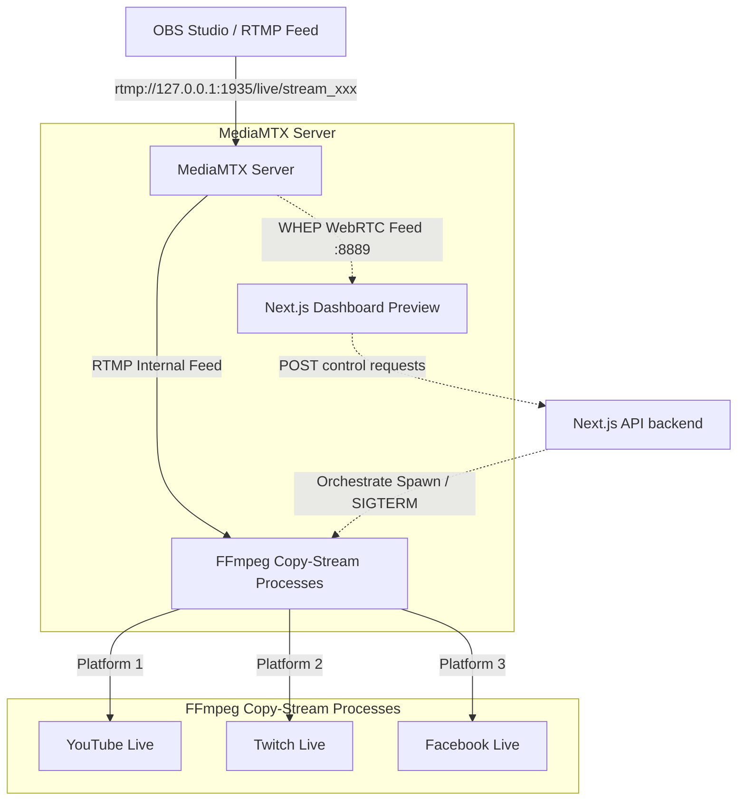

# MyStream Restreaming Engine Studio

MyStream Studio adalah dashboard multistreaming mandiri berbasis **Next.js**, **MediaMTX**, dan **FFmpeg**. Aplikasi ini dirancang untuk menangkap satu sinyal siaran (*ingest feed*) dari OBS Studio dan menyalurkannya kembali secara bersamaan (*restream*) ke beberapa platform streaming tujuan (seperti YouTube, Twitch, Facebook, dll.) dengan penggunaan resource CPU yang sangat rendah.

---

## Arsitektur Alur Data



---

## Fitur Utama

1. **Multistreaming Tanpa Beban CPU (Zero Re-Encoding)**: Menggunakan parameter `-c copy` pada FFmpeg untuk langsung menduplikasi stream video dan audio tanpa proses encoding ulang. Penggunaan CPU tetap berada di kisaran `< 5%`.
2. **Preview Real-Time Tanpa Latensi (WebRTC WHEP)**: Menggunakan teknologi WebRTC untuk menampilkan umpan balik OBS di dashboard web dengan delay `< 0.5` detik.
3. **Ingest Key Dinamis & Acak**: Dilengkapi dengan stream key acak otomatis yang tersimpan di browser untuk mencegah bentrokan siaran.
4. **Theme Switcher**: Segmentasi tombol khusus untuk beralih antara **Tema Terang (Light Mode)**, **Tema Gelap (Dark Mode)**, dan **Tema Sistem OS (System)**.
5. **Panel Logs Interaktif**: Memantau output log proses FFmpeg secara terpisah per platform secara real-time.
6. **FAQ Interaktif**: Jawaban instan untuk pertanyaan umum seputar teknis streaming dan OBS di bagian footer.

---

## Prasyarat & Instalasi Alat Mandiri

Sistem ini membutuhkan dua alat pihak ketiga yang terpasang di komputer Anda:

### 1. FFmpeg
* Pastikan FFmpeg terinstal di folder: `C:\ffmpeg`
* Jalur binary exe harus berada di: `C:\ffmpeg\ffmpeg-master-latest-win64-gpl-shared\bin\ffmpeg.exe` (atau terdaftar secara global pada environment system PATH Anda).

### 2. MediaMTX
* Pastikan folder MediaMTX berada di: `C:\mediamtx`
* Konfigurasi MediaMTX diambil secara dinamis dari file `mediamtx.yml` yang ada di root proyek ini untuk mengizinkan akses WebRTC dan CORS.

---

## Cara Menjalankan Aplikasi

1. Clone repositori ini dan masuk ke direktori proyek.
2. Instal semua dependensi Node.js:
   ```bash
   npm install
   ```
3. Jalankan server pengembangan (Next.js & MediaMTX akan berjalan bersamaan):
   ```bash
   npm run dev
   ```
4. Buka browser Anda dan akses: **[http://localhost:3000](http://localhost:3000)**.

---

## Konfigurasi Penting di OBS Studio

Agar stream Anda dapat terhubung dan tampil di pemutar WebRTC Dashboard, ikuti konfigurasi wajib berikut:

### 1. Pengaturan Alamat Stream
* Buka **Settings** > **Stream** di OBS.
* Pilih **Service** ke **Custom...**
* Masukkan **Server**: `rtmp://127.0.0.1:1935/live`
* Masukkan **Stream Key**: *Salin Stream Key acak yang tertulis di panel Ingest dashboard web Anda.*

### 2. Pengaturan Encoder & Penonaktifan B-Frames (Wajib untuk WebRTC)
WebRTC tidak mendukung kompresi frame jenis B-frames. 
* Buka **Settings** > **Output**.
* Ubah **Output Mode** menjadi **Advanced** di bagian paling atas.
* Pada tab **Streaming**:
  * **Keyframe Interval**: Setel ke **`2s`** (Wajib agar segmen video konsisten).
  * **Jika menggunakan encoder NVIDIA NVENC / AMD H.264**:
    Cari opsi **Max B-frames** (B-frames Maks) di bagian bawah dan **ubah nilainya menjadi `0`**.
  * **Jika menggunakan encoder x264 (CPU)**:
    Pada kolom **x264 Options** di bagian paling bawah, ketik: `bframes=0` atau `tune=zerolatency`.

---

## Struktur Direktori Proyek

* `app/page.tsx` — Komponen antarmuka dashboard studio, logika UI, dan FAQ.
* `app/globals.css` — Sistem styling CSS variabel pendukung glassmorphism serta pergantian tema warna dinamis.
* `app/api/restream/route.ts` — Kontrol backend API penanganan spawning proses FFmpeg per destinasi platform.
* `package.json` — Pengaturan skrip start terintegrasi menggunakan library `concurrently`.
* `mediamtx.yml` — Konfigurasi server distribusi stream MediaMTX (RTMP, HLS, WebRTC).
